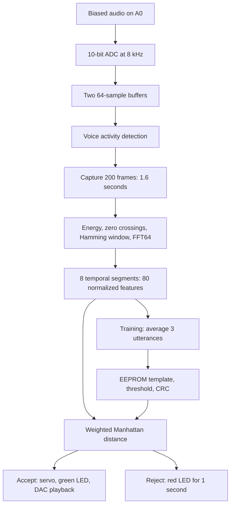

# Voice-Authenticated Smart Parking Lock


A register-level embedded-systems teaching project for **Arduino Uno R3 / ATmega328P**. It learns one speaker saying the Persian passphrase **«پارکینگ باز شو»** (“Parking, open”), compares later utterances against that acoustic template, and drives a servo gate and audio output when a match is accepted.

The project connects three peripherals in one application:

- **ADC:** interrupt-driven, 10-bit voice acquisition at 8 kHz.
- **PWM:** Timer1 hardware PWM for a servo gate at 50 Hz.
- **DAC:** 6-bit PCM playback through an external R-2R resistor ladder.

**Project status:** both firmware variants build; the reference implementation passes its host tests. No Proteus project or voice recordings are included, and the Proteus simulation has not been run. The bundled confirmation audio is a test signal. This is an educational prototype; real-speaker authentication accuracy has not been measured.

## Choose a version

| Directory | Purpose | What to expect |
|---|---|---|
| [`full-solution/`](full-solution/) | Complete reference implementation | Implemented firmware, passing recognition tests, design documents, and circuit specifications |
| [`student-starter/`](student-starter/) | Coursework starter | Compiles with intentional `TODO` stubs; recognition tests fail until the exercises are completed |
| [`tools/`](tools/) | Shared Python audio utilities | WAV preparation, 6-bit audio conversion, DSP table generation, and unit tests |

Each firmware directory is self-contained, with its own build configuration, source, headers, tests, tools, and documentation. Students should start with the [assignment](student-starter/ASSIGNMENT.md) and [grading rubric](student-starter/GRADING_RUBRIC.md).

## Quick start

### Requirements

- **PlatformIO Core** for building the AVR firmware. PlatformIO installs the AVR platform and toolchain on the first build.
- **Python 3.10 or newer** for the audio tools; they use only the standard library.
- **A C++17 compiler available as `g++`** for the host recognition tests.
- **Proteus with an Arduino Uno / ATmega328P model** for circuit simulation, or a wired physical board for a hardware experiment.
- **simavr**, optionally, for the AVR cycle benchmark.

The shell examples below use a POSIX shell. Run them from the repository root unless a command changes directories.

### Clone and build the reference firmware

```sh
git clone https://github.com/ashkanchaji/Voice-Authenticated-Smart-Parking-Lock.git
cd Voice-Authenticated-Smart-Parking-Lock

# Skip this environment setup if PlatformIO is already installed.
python3 -m venv .venv
. .venv/bin/activate
python -m pip install platformio

pio run --project-dir full-solution
```

Build outputs:

```text
full-solution/.pio/build/uno/firmware.hex   # Program File for Proteus
full-solution/.pio/build/uno/firmware.elf   # Firmware with debugging information
```

The firmware uses **bare-metal AVR C++**, with no Arduino framework. It owns all three timers and configures ADC, PWM, GPIO, UART, and EEPROM directly. There is no dependency on `analogRead()`, `analogWrite()`, `Servo.h`, `tone()`, or `delay()`.

### Run the tests

```sh
# Real DSP and recognition modules, compiled for the host; no board required.
./full-solution/test/run.sh

# Audio utility tests; no third-party Python packages required.
python3 -m unittest discover -s tools/tests -v

# Optional: measure DSP execution time on a simulated ATmega328P.
pio pkg install -g -t tool-simavr
./full-solution/test/bench.sh
```

The benchmark expects PlatformIO packages under `~/.platformio/packages`. Set `PIO_PKG` to your package directory if you use a different location.

To work on the student version:

```sh
pio run --project-dir student-starter
./student-starter/test/run.sh
```

A nonzero test exit code is expected for the unmodified starter.

## How recognition works

This is **acoustic template matching**, not speech-to-text. The firmware does not decode Persian words or independently classify a speaker. It compares the combined speaker-and-phrase pattern against one stored template.



Each 64-sample frame spans **8 ms**. The firmware accumulates short-time energy, zero-crossing counts, and eight FFT band magnitudes into eight **200 ms** segments. It normalizes the result to an **80-byte feature vector** without storing the complete recording in SRAM.

Training averages three feature vectors and derives an acceptance threshold from their distance to that average:

```text
spread    = maximum training-to-template distance
threshold = min(2 × spread + 1060, 7956)
accept    = input-to-template distance <= threshold
```

Energy differences have weight 3, zero-crossing differences weight 2, and each spectral-band difference weight 1. The template, threshold, format version, and CRC occupy a **90-byte EEPROM record**.

See the [recognition algorithm](full-solution/docs/recognition-algorithm.md) for the arithmetic, frequency bands, and limitations.

## Hardware and timer allocation

Target: **ATmega328P at 16 MHz**, with 32 KB flash, 2 KB SRAM, and 1 KB EEPROM. The Uno build allows 32,256 bytes of application flash.

| Connection | Function |
|---|---|
| A0 / PC0 / ADC0 | Audio input, AC-coupled and biased to approximately 2.5 V |
| A1 / PC1 | Green access-granted LED |
| A2 / PC2 | Red access-denied LED |
| D2–D7 / PD2–PD7 | Six R-2R DAC bits; D2 is the least significant bit |
| D8 / PB0 | Training button to ground; active low with internal pull-up |
| D9 / PB1 / OC1A | Servo PWM output |
| D1 / PD1 / TXD | UART output to the terminal |
| D0 / PD0 / RXD | Reserved UART pin; keep clear of the DAC |

| Timer | Configuration | Role |
|---|---|---|
| Timer0 | CTC, prescaler 64, `OCR0A = 249` | 1 ms system tick |
| Timer1 | Fast PWM mode 14, prescaler 8, `ICR1 = 39999` | 50 Hz servo PWM |
| Timer2 | CTC, prescaler 8, `OCR2A = 249` | Shared 8 kHz ADC trigger / DAC playback clock |

**Sampling and playback are mutually exclusive.** Timer2 switches modes after recognition; the device resumes listening after the gate closes. Timer1 continues producing servo pulses while Timer2 plays audio.

Default servo pulses are **1 ms locked** and **2 ms unlocked**, with a **3-second** gate-open interval. Actual angles depend on the servo and linkage; calibrate the endpoints in [`config.h`](full-solution/include/config.h) or through `servo_configure()`.

The circuit also needs an input bias/filter network, a 6-bit **10 kΩ / 20 kΩ R-2R ladder**, an output reconstruction filter, an LM386 amplifier, and a speaker. Use the [BOM](full-solution/proteus/BOM.csv), [pin map](full-solution/proteus/pin-map.md), and [wiring guide](full-solution/proteus/wiring.md) for the complete circuit. A live microphone needs appropriate amplification and filtering before A0; the supplied simulation specification uses a WAV source.

## Training and operation

1. Connect the circuit and open a UART terminal at **115200 baud, 8N1**. For a physical board, use `pio device monitor --project-dir full-solution` after selecting its serial port.
2. On boot, the firmware checks the EEPROM record. A valid template starts normal listening; a missing or invalid template produces `TRAINING REQUIRED`.
3. Press and release D8's training button. Wait for `TRAINING SAMPLE 1/3 - SPEAK NOW`, then say **«پارکینگ باز شو»**. Repeat for samples 2 and 3, using the same speaker, pace, microphone distance, and room.
4. After the third sample, the terminal prints training distances, `TEMPLATE SAVED`, and `THRESHOLD`. The device enters `IDLE - LISTENING FOR PASSPHRASE`.
5. A detected utterance starts a fixed **1.6-second** capture. A match prints `ACCESS GRANTED`, opens the servo gate, lights the green LED, and starts DAC audio. The gate closes after three seconds. A rejection prints `ACCESS DENIED` and lights the red LED for one second.
6. Hold the training button for **two seconds** to erase the template, close the gate, and start retraining from any state.

A training attempt times out after **15 seconds** without a completed capture. `WARNING: THRESHOLD CLAMPED` indicates inconsistent training recordings; retrain under more consistent conditions. `ADC OVERRUN` indicates dropped frames and needs timing investigation.

Gate and indication timing use the system tick rather than delays. DSP runs in the main loop, while interrupts handle sampling and playback. UART output and EEPROM programming are synchronous.

## Prepare audio and a Proteus simulation

### Record the voice dataset

Place the following PCM WAV recordings in `full-solution/assets/`:

| Files | Recording |
|---|---|
| `train1.wav`, `train2.wav`, `train3.wav` | Authorized speaker saying the passphrase three separate times |
| `correct.wav` | A new recording of the same speaker and passphrase |
| `wrong_phrase.wav` | Same speaker saying a different phrase |
| `wrong_speaker.wav` | Different speaker saying the passphrase |
| `wrong_both.wav` (optional) | Different speaker saying a different phrase |

Aim for **1.2–1.6 seconds of speech**, with **0.2–0.5 seconds of leading silence**, consistent recording conditions, and no clipping. Mono is preferred; the utilities also accept stereo and resample to 8 kHz.

Create one continuous input WAV for the simulation:

```sh
python3 tools/prepare_voice_dataset.py \
    --train full-solution/assets/train1.wav \
            full-solution/assets/train2.wav \
            full-solution/assets/train3.wav \
    --test full-solution/assets/correct.wav \
           full-solution/assets/wrong_phrase.wav \
           full-solution/assets/wrong_speaker.wav \
    -o full-solution/assets/scenario.wav
```

The tool equalizes clip peaks, adds a one-second lead-in and five-second gaps, and prints a timeline. Use that timeline to press the training button before each training clip.

### Replace the confirmation test signal

The bundled [`success_audio.h`](full-solution/include/success_audio.h) contains a **0–63 staircase and a 1 kHz tone**, useful for validating the DAC. It does not contain the intended Persian message **«ورود مجاز است»** (“Access granted”).

Record that message as `full-solution/assets/success_fa.wav`, keep it at or below the default **1.8-second** conversion limit, then run:

```sh
python3 tools/wav_to_6bit_header.py full-solution/assets/success_fa.wav \
    -o full-solution/include/success_audio.h
pio run --project-dir full-solution
```

The converter emits unsigned 6-bit PCM in `PROGMEM` and clears the placeholder flag. Audio costs **8,000 bytes of flash per second**; check flash usage after rebuilding. The generated DSP and audio headers are included in the repository because the firmware needs them to build.

### Assemble and validate the simulation

1. Create a Proteus schematic from the [BOM](full-solution/proteus/BOM.csv) and [wiring guide](full-solution/proteus/wiring.md).
2. Set the Uno model's clock to **16 MHz** and its Program File to `full-solution/.pio/build/uno/firmware.hex`.
3. Load `full-solution/assets/scenario.wav` into the audio generator. Connect the UART terminal and oscilloscope as specified.
4. Run the training sequence, then the recognition cases. Measure the A0 bias, D9 pulse widths, DAC output, and UART diagnostics using the [validation checklist](full-solution/proteus/validation-checklist.md).

No `.pdsprj` is supplied. These files specify how to build and test the circuit; they do not establish that it has passed a Proteus simulation. See the [simulation guide](full-solution/proteus/README.md) for the session sequence and EEPROM persistence setup.

## Verified results

Local verification used **PlatformIO 6.1.19**, **Atmel AVR 5.3.0**, and **avr-gcc 7.3.0**.

| Check | Reference implementation | Unmodified student starter |
|---|---|---|
| Uno firmware build | Pass | Pass |
| Flash usage | 9,360 / 32,256 bytes (29.0%) | 1,048 / 32,256 bytes (3.2%) |
| Static SRAM usage | 1,183 / 2,048 bytes (57.8%) | 102 / 2,048 bytes (5.0%) |
| Host recognition tests | 12,220 checks passed | 2,461 checks; 467 expected failures |

The shared Python tools pass **21 unit tests**. The simavr benchmark measures **28,069 cycles**, or **1.754 ms**, for feature processing of one frame—about **22% of the 8 ms frame budget**. Static SRAM figures exclude runtime stack use, and flash figures include the bundled placeholder audio.

Host tests use synthetic signals to exercise FFT arithmetic, normalization, VAD, distance, threshold calculation, CRC, and the recognition pipeline. They demonstrate implementation behavior, not accuracy on human voices or physical circuit operation.

## Limitations

- **One speaker and one template.** Speaker identity and phrase content share one score; a rejection does not identify which failed.
- **Fixed timing.** Capture lasts 1.6 seconds, with fixed 200 ms segments and no time alignment. Speaking speed, room acoustics, and microphone position affect matching.
- **No liveness or replay protection.** The firmware does not distinguish live speech from a recording.
- **Coarse features.** Eight spectral bands and a simple distance threshold provide an educational recognition model, not a validated access-control system.
- **No included recordings or completed simulation.** Collect real voice data and validate the circuit before reporting acceptance or rejection performance.
- **Basic analog front end.** The first-order input filter is intended for a band-limited simulation source; live microphone use needs further analog design.

## Code and documentation map

```text
.
├── README.md
├── THIRD_PARTY_NOTICES.md
├── full-solution/
│   ├── platformio.ini          Uno build and UART settings
│   ├── src/                    State machine, peripherals, DSP, recognition
│   ├── include/                Interfaces, configuration, generated tables/audio
│   ├── test/                   Host tests and simavr cycle benchmark
│   ├── docs/                   Design explanations and resource budgets
│   ├── proteus/                BOM, pin map, wiring, validation checklist
│   ├── assets/                 Recording instructions; add WAV files here
│   └── tools/                  Standalone copy of the audio utilities
├── student-starter/            Same layout, with coursework stubs and rubric
└── tools/                      Shared utilities and Python tests
```

Start with [`src/main.cpp`](full-solution/src/main.cpp) for the state machine and [`include/config.h`](full-solution/include/config.h) for tuning constants.

| Guide | Contents |
|---|---|
| [Architecture](full-solution/docs/architecture.md) | Signal path, state transitions, interrupt responsibilities, module map |
| [Recognition algorithm](full-solution/docs/recognition-algorithm.md) | FFT bands, features, normalization, training, distance, limitations |
| [ADC](full-solution/docs/adc.md) | Input circuit, registers, conversion timing, ping-pong buffers |
| [Servo PWM](full-solution/docs/pwm-servo.md) | Timer1 setup, pulse widths, endpoint calibration |
| [R-2R DAC](full-solution/docs/r2r-dac.md) | Ladder design, port masking, reconstruction, audio flash cost |
| [Timers](full-solution/docs/timers.md) | Timer ownership and DSP execution budget |
| [Memory budget](full-solution/docs/memory-budget.md) | SRAM, stack, flash, and EEPROM allocation |
| [Proteus testing](full-solution/docs/proteus-testing.md) | Test cases and expected measurements |
| [Audio assets](full-solution/assets/README.md) | Recording specifications and conversion workflows |
| [Cornell comparison](full-solution/docs/cornell-comparison.md) | Design differences from the original Speech Lock project |

## Troubleshooting

| Symptom | Check |
|---|---|
| `TRAINING REQUIRED` after restart | EEPROM may be blank or invalid. Retrain; for Proteus, configure EEPROM persistence or test an MCU reset within the same session. |
| Correct phrase is rejected | Keep pace and recording conditions consistent. Inspect training distances and the threshold, then retrain. |
| `ADC OVERRUN` appears | Frames are being dropped. Avoid extra UART output during capture and rerun the cycle benchmark. |
| Confirmation sounds like a tone | The bundled audio is a placeholder. Generate a new `success_audio.h` from the recorded message. |
| Student tests fail | The starter deliberately contains stubs. Follow the assignment and complete its `TODO` sections. |

## Acknowledgments

Inspired by Cornell ECE4760's [Speech Lock](https://people.ece.cornell.edu/land/courses/ece4760/FinalProjects/f2014/wjs253_rrs72_ral255/speech_lock_webpage/speech_lock_webpage/webpage.html), by William Salcedo, Rafael Ramos, and Rene Lorenzo. The fixed-point FFT adapts Bruce Land's AVR work, derived from Tom Roberts and Malcolm Slaney.

See [THIRD_PARTY_NOTICES.md](THIRD_PARTY_NOTICES.md) for attribution and licensing notes.
